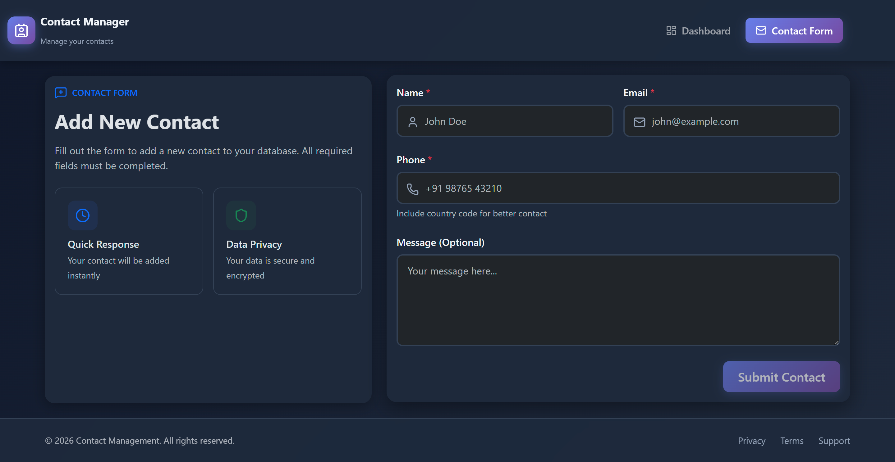
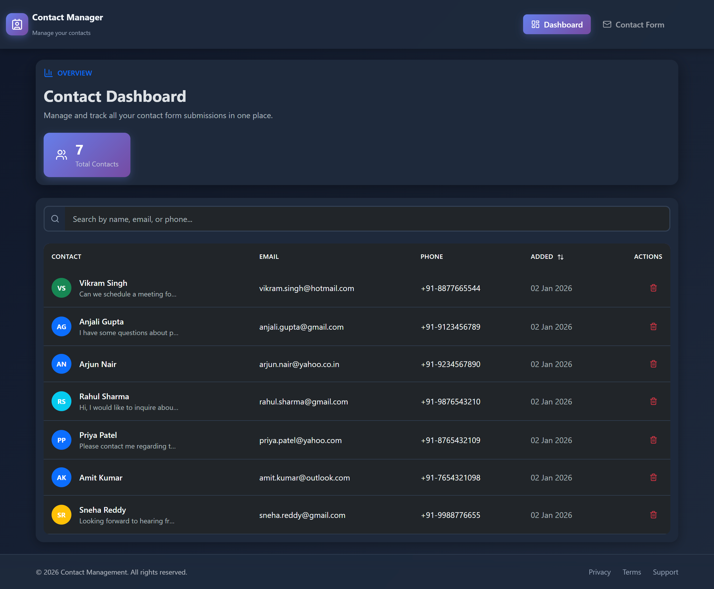

# 📇 Contact Manager

<div align="center">


**A modern, full-stack contact management application with a sleek dark-themed UI**

[Features](#-features) • [Tech Stack](#-tech-stack) • [Getting Started](#-getting-started) • [API Endpoints](#-api-endpoints) • [Project Structure](#-project-structure)

</div>

---

🌐 **Demo:** https://contact-managment-frontend.onrender.com/

## 📸 Screenshots

### Contact Form
*Add new contacts with an intuitive, user-friendly interface*



### Dashboard View
*Manage and view all your contacts in one place*



---

## ✨ Features

- 📝 **Create Contacts** - Add new contacts with name, email, phone, and optional message
- 📋 **View Dashboard** - Browse all saved contacts in an organized layout
- 🔄 **Real-time Updates** - Instant feedback when adding or modifying contacts
- 🎨 **Modern Dark UI** - Clean, professional dark theme design
- 📱 **Responsive Design** - Works seamlessly on desktop and mobile devices
- 🔒 **Data Privacy** - Secure data handling with encrypted storage
- ⚡ **Quick Response** - Fast, instant contact additions

---

## 🛠 Tech Stack

### Frontend
| Technology | Purpose |
|------------|---------|
| **React 19** | UI Component Library |
| **Vite** | Build Tool & Dev Server |
| **Tailwind CSS** | Utility-First Styling |
| **React Router DOM** | Client-Side Routing |
| **Axios** | HTTP Client |
| **Lucide React** | Icon Library |
| **Bootstrap** | Additional UI Components |

### Backend
| Technology | Purpose |
|------------|---------|
| **Node.js** | Runtime Environment |
| **Express.js** | Web Framework |
| **MongoDB** | NoSQL Database |
| **Mongoose** | ODM for MongoDB |
| **CORS** | Cross-Origin Resource Sharing |
| **dotenv** | Environment Variables |

---

## 🚀 Getting Started

### Prerequisites

- **Node.js** (v18 or higher)
- **MongoDB** (local installation or MongoDB Atlas)
- **npm** or **yarn**

### Installation

1. **Clone the repository**
   ```bash
   git clone https://github.com/Rahulsannnamath/contact-managment.git
   cd contact-managment
   ```

2. **Set up the Backend**
   ```bash
   cd backend
   npm install
   ```

3. **Configure environment variables**
   
   Create a `.env` file in the `backend` directory:
   ```env
   PORT=5000
   MONGODB_URI=your_mongodb_connection_string
   NODE_ENV=development
   ```

4. **Set up the Frontend**
   ```bash
   cd ../frontend
   npm install
   ```

5. **Run the application**

   Start the backend server: 
   ```bash
   cd backend
   node server.js
   ```

   In a new terminal, start the frontend:
   ```bash
   cd frontend
   npm run dev
   ```

6. **Open your browser**
   
   Navigate to `http://localhost:5173` to view the application. 

---

## 📡 API Endpoints

| Method | Endpoint | Description |
|--------|----------|-------------|
| `GET` | `/api/contacts` | Fetch all contacts |
| `POST` | `/api/contacts` | Create a new contact |
| `GET` | `/api/contacts/:id` | Get a specific contact |
| `PUT` | `/api/contacts/:id` | Update a contact |
| `DELETE` | `/api/contacts/:id` | Delete a contact |

---

## 📁 Project Structure

```
contact-managment/
├── backend/
│   ├── controllers/      # Request handlers
│   ├── db. config/        # Database configuration
│   ├── models/           # Mongoose schemas
│   ├── routes/           # API routes
│   ├── server.js         # Entry point
│   └── package.json
│
├── frontend/
│   ├── src/
│   │   ├── assets/       # Static assets
│   │   ├── components/   # Reusable UI components
│   │   ├── context/      # React context providers
│   │   ├── hooks/        # Custom React hooks
│   │   ├── pages/        # Page components
│   │   ├── services/     # API service functions
│   │   ├── App.jsx       # Root component
│   │   └── main.jsx      # Entry point
│   └── package.json
│
└── README.md
```

---

## 🎯 Key Highlights

- **Clean Architecture** - Separation of concerns with organized folder structure
- **RESTful API** - Well-structured API endpoints following REST conventions
- **Context API** - Efficient state management using React Context
- **Custom Hooks** - Reusable logic abstracted into custom hooks
- **Error Handling** - Comprehensive error handling on both frontend and backend
- **Environment Configuration** - Secure configuration using environment variables

---

## 📄 License

This project is open source and available under the [MIT License](LICENSE).

---

## 👤 Author

**Rahul Sannamath**

- GitHub: [@Rahulsannnamath](https://github.com/Rahulsannnamath)

---

<div align="center">


</div>
